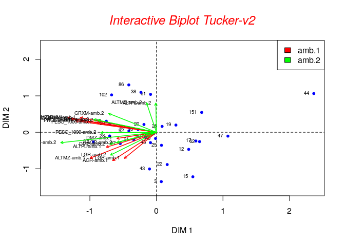

<!-- README.md is generated from README.Rmd. Please edit that file -->
### tuckerR.mmgg

This package performs Three-Mode Principal Components using Tuckers Models and plot interactive Biplot.Some experiment design generated three-way or three-mode data, repeated observations of a set of attributes for a set of individuals in different conditions. The information was displayed in a three-dimensional array, and the structure of the data was explored using Three-Mode Principal Component Analysis, the Tucker-2 Model.

### Installation

``` r
devtools::install_github("gusart/tuckerR_mmgg")
```

### Important contribution of this package

The most important contribution of this package are the interactive biplot graphics and the application of the `diffit()` function to find the best combination of components to retain.

``` r
library(tuckerR.mmgg)
#> 
#> Attaching package: 'tuckerR.mmgg'
#> The following object is masked from 'package:graphics':
#> 
#>     plot
data(maize_pop)
output <- tucker2R(maize_pop,amb=2,stand=TRUE,nc1=3,nc2=3)
```

### Extract the core matrix.

``` r
output$matrizG  
#>           [,1]     [,2]      [,3]      [,4]     [,5]       [,6]
#> [1,] 10.260719 1.847900  3.553432  8.380775 3.021522 -0.5999851
#> [2,] -2.014825 3.989558  3.306571 -1.322206 3.332721 -4.2685767
#> [3,] -1.290695 3.355101 -3.429868  1.325232 3.341179  3.2866310
```

### The plot from output of function

``` r
plot(output) 
```


